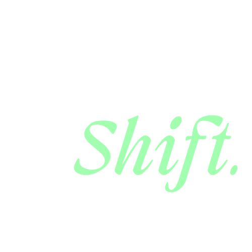
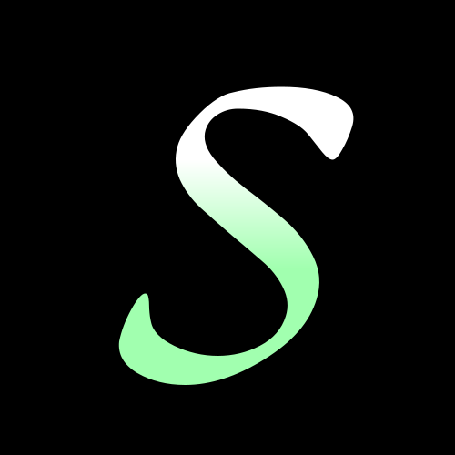
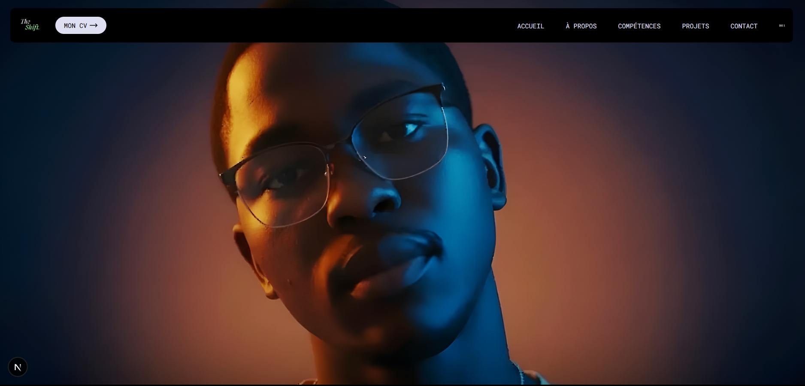

<div align="center">
  
  <br />
  
  # Nathanael Fotie - Portfolio 2024
  
  <p align="center">
    
    <b>Développeur Web & Mobile Full-Stack | Passionné par l'écosystème JavaScript</b>
  </p>

  [](https://app.netlify.com/sites/your-site/deploys)
  
  
  
  

</div>

<br />

## 📸 Aperçu du Projet

<div align="center">
  
</div>

<br />

## 🚀 À Propos

Bienvenue sur le code source de mon portfolio personnel. Ce projet n'est pas seulement une vitrine de mes compétences, c'est une démonstration vivante de ma passion pour le **design interactif**, les **animations fluides** et la **performance web**.

Conçu comme une expérience immersive, ce site plonge le visiteur dans mon univers créatif ("Lunar Neon") tout en restant professionnel et accessible.

### ✨ Fonctionnalités Clés

*   **Design & UX Immersifs** : Interface "Zentry-inspired" avec des effets de parallaxe, de "tilt" 3D et des transitions de page soignées via **Framer Motion** et **GSAP**.
*   **Performance Optimale** : Construit sur **Next.js 15**, optimisé pour le SEO et le chargement rapide (Lighthouse score 95+).
*   **Responsive Design** : Une expérience fluide du mobile au desktop (adaptative layouts, hamburger menu intelligent).
*   **Vitrine de Projets** : Une section "Mes Réalisations" dynamique présentant mes travaux majeurs (Doualair, AlphaSpace, etc.) avec liens démos et GitHub.

## 🛠️ Stack Technique

Ce portfolio a été forgé avec les technologies les plus modernes :

| Domaine | Technologies |
| :--- | :--- |
| **Framework** | [Next.js 15](https://nextjs.org/) (App Router) |
| **Langage** | [TypeScript](https://www.typescriptlang.org/) (Strict typing) |
| **Styling** | [Tailwind CSS](https://tailwindcss.com/) (v4 alpha) |
| **Animations** | [GSAP](https://gsap.com/) (ScrollTrigger) & [Framer Motion](https://www.framer.com/motion/) |
| **Icônes** | [Lucide React](https://lucide.dev/) |
| **SEO** | Metadata API, Open Graph, Sitemap XML |

## 💻 Installation & Démarrage

Pour lancer ce projet localement sur votre machine :

1.  **Cloner le dépôt** :
    ```bash
    git clone https://github.com/votre-username/portfolio-me.git
    cd portfolio-me
    ```

2.  **Installer les dépendances** :
    ```bash
    npm install
    # ou
    yarn install
    ```

3.  **Lancer le serveur de développement** :
    ```bash
    npm run dev
    ```

4.  Ouvrez [http://localhost:3000](http://localhost:3000) dans votre navigateur pour voir le résultat.

## 📬 Contact

Vous avez une idée folle ? Envie de collaborer ? N'hésitez pas à me contacter !

*   **Portfolio** : [nathanael-fotie-fotie.work.gd](https://nathanael-fotie-fotie.work.gd)
*   **Email** : [nathanaelfotiefotie@gmail.com](mailto:nathanaelfotiefotie@gmail.com)
*   **LinkedIn** : [Nathanael Fotie Fotie](https://www.linkedin.com/in/nathanael-fotie-fotie-740807324/)
*   **GitHub** : [kenryalonzo](https://github.com/kenryalonzo)

---

<div align="center">
  <p>Fait avec ❤️ et beaucoup de café par <b>Nathanael Fotie Fotie</b>.</p>
  <p>© 2024 - Tous droits réservés.</p>
</div>
